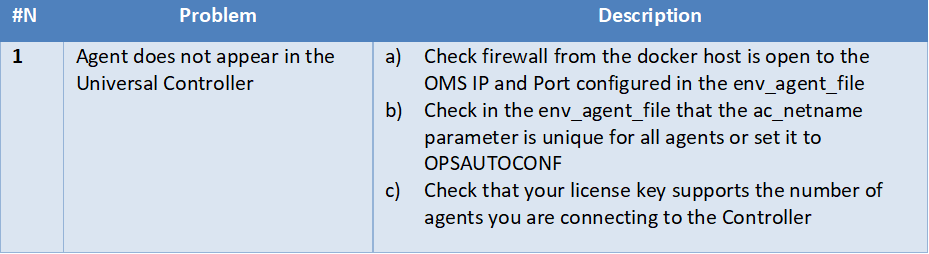

# script-dockerfile-centos-linux
# Abstract: 

This document provides all steps how to create a centos7 container with a fully configured Universal Agent inside. After performing all steps, you can schedule any application installed in your container using the Universal Controller Web-Client or REST API or any other Scheduler.   
# 1	Disclaimer
No support and no warranty are provided by Stonebranch GmbH for this document and the related Universal Task. The use of this document and the related Universal Task is on your own risk.

Before using this task in a production system, please perform extensive testing.

Stonebranch GmbH assumes no liability for damage caused by the performance of the Universal Tasks

# 2	Scope 
This document provides a documentation how to create a centos7 container with a fully configured Universal Agent inside. 

It describes the steps to build the image using a predefined Dockerfile and how to build and start containers from that image. 

# 3	Introduction
Docker Container are an effortless way to deploy applications because containers that contain all the necessary packages are easy to transport and install as files. Containers ensure the separation and management of resources used on a computer. This includes: code, runtime module, system tools, system libraries - everything that can be installed on one computer. 

Due to this concept container are used in many C:D DevOps processes.

From a Scheduling point of view an application in a container needs to be scheduled like any other application. Universal Automation Center automates the entire life cycle for scheduling an application in a container:

  1.	 Providing a Dockerfile to build an OS image e.g. Centos, SUSE, .. with a Universal Agent 
  2.	 Downloading a container image from an image store like the open or private docker hub
  3.	 Creating a container based on the selected image
  4.	 Starting a container
  5.	 Scheduling the and Launching the application in the container
  6.	 Stopping a container
  7.	 Removing a container
  8.	 Removing the local image of the container 
  
This document covers Step 1 and 2 describing the steps to build the image using a predefined Dockerfile and how to build and start containers from that image. 

# 4	Installation
To install a Universal Agent in a Docker image the following Prerequisites are required:
Docker Engine installed on your docker host
-	Client:  Version:      17.09.1-ce
-	Server: Version:      17.09.1-ce
For Information how to install the docker engine refer to:
https://docs.docker.com/install/

**Software requirements:**

Universal Agent 
A Universal Agent installation file (This file is available for download from the Stonebranch Customer Portal: https://stonebranch.zendesk.com/hc/en-us) of Version 6.4.x is required (Note earlier Version 5.2. or later might also work)

The examples in this document have been done with the Agent Install file:
-	sb-6.4.2.2-linux-2.6-x86_64.tar.Z

**Universal Controller**

Universal Controller Version 6.x is needed for the Agent in the Container to connect to the Universal Controller (Note earlier Controller Version 5.2.x or later might also work).

Note: Any Other Scheduler can also connect to the Universal Agent in the Container.

# 5	DOCKER Build Context
The first step to create a Docker image is to create the build context. The build context contains all files required to build the image.

To build context to create a CentOS container with a Universal Agent contains:
-	Dockerfile – to build the base Linux Image containing a Universal Agent
-	sb-6.4.2.2-linux-2.6-x86_64.tar.Z – universal agent application
-	env_agent_file – universal agent configuration parameters, which are used when initiating the container from the image
-	ucmd – pam configuration for linux

**Installation of the build context:**

**1.	Download and extract the build context**
 
Download and extract the build context tar file “dockeragent_centos.tar” to a directory on your docker host:

tar -xvf dockeragent_centos.tar

Tar-file content:

Image 1

**2.	Copy the Agent Install file to the build context folder**

Download from the Stonebranch Customer Portal an Agent Install file of Version 6.4.x (Note earlier Version 5.2.x or later might also work) and copy it to the build context.
The examples in this document have been done with the Agent Install file:
-	sb-6.4.2.2-linux-2.6-x86_64.tar.Z

**To start building the docker image your build context folder should contain the following files:**

Image 2

 
 
# 6	Docker Image 
To create a container with a universal agent you first need to build the docker image as a base to build a container. This is a onetime action.

The docker image containing a Universal Agent is build using the following command:

docker build --build-arg agentfile=sb-6.4.2.2-linux-2.6-x86_64.tar.Z -t centos7_img . 

Description:

Image 3

**Check:
If the build command was successful you should see the following images:**

Image 4

**Build Image Process:**

The following described what is happing during the build process:

The docker build command reads the Dockerfile and performs the following steps:

- Download the based centos 7 image from the internet (FROM centos:7)
- Create a working directory in that image ( WORKDIR "/root/stonebranch")
- Add from the local file system the agent installer file (ADD ${agentfile}/root/stonebranch/)
- Add from the local file system the PAM configuration file umd (ADD ucmd /etc/pam.d/)
- Extract the Agent installer file in the image (RUN tar -xvzf /root/stonebranch/${agentfile} -C /root/Stonebranch)

Note: After these steps you have a centos 7 images (centos_img:latest) with the extracted agent installer file and the PAM configuration. **The agent is not yet installed.**

# 7	Docker Container
Once the image has been built you can create one or more containers from that images. Each container is like an own VM with own IP, hostname etc.

To build a container two steps need to be done:
**1.	Configure the Universal Agent Installation settings**

In the file env_agent_file you need to configure the Agent settings:
Example env_agent_file:

Image 5:

Image 6:

**Note:** The Universal Agent has many more configuration Parameters. If you need additional Parameters, the Dockerfile needs to be adjusted accordingly. 
 
**2.	Build the docker container**
To build the container execute the following command:

docker run -it -d --hostname=centos01 --env-file=env_agent_file --name centos7_container centos7_img:latest

Image 7

**Check:
If the container build was successful you should see the following running container:**

Image 8

 
**Additionally, you should check the container log file:**

docker logs centos7_container1

**Build Container process:**
The following described what is happing during the build container process.

This process is executed each time you create a new container from the image. 

The docker run commands executed the **CMD command** in the **Dockerfile.**

When the container run command is executed the image centos7_img:latest is taken as a base to build the container. The environment variables are set, as defined in the env_agent_file (OMS_SERVERS, ac_netname, ..) and the command defined the docker file starting with CMD (line 52 ) is executed. Note: Only the Command CMD is executed when building the container. The CMD does the installation of the Universal Agent.

**Note:** After executing the CMD command the Docker container is created and can be started and stop as required.

Example:
The following screenshot shows three containers connect to the universal controller:

Image 9

These are the commands, which have been executed to build the three containers:

**First Container:**

 1.	 Changed in the env_agent_file then name to nils_agent_1
 2.	 docker run -it -d --hostname=centosDEV --env-file=env_agent_file --name centos7_container1 centos7_img:latest

**Second Container:**
 1.  Changed in the env_agent_file then name to nils_agent_2
 2.	 docker run -it -d --hostname=centosTEST --env-file=env_agent_file --name centos7_container2 centos7_img:latest

**Third Container:**
 1.	 Changed in the env_agent_file then name to nils_agent_3
 2.  docker run -it -d --hostname=centosQA --env-file=env_agent_file --name centos7_container3 centos7_img:latest
 
# 8	Docker Commands
The following provides some useful docker cli commands:

**General** 

**docker version**

*docker version*

**docker cli command to list images**

*docker images*

**docker cli to list container**

*docker ps -a*

**docker cli commands to start/stop a container**

*docker start centos7_container*
*docker stop centos7_container*

**container log file:**

*docker logs centos7_container1*

**Open a shell in a running container**

*docker exec -it centos7_container /bin/bash*

**Agent commands in the container**

*Start/Stop/restart/Status/Restart Universal Agent*

*/opt/universal/ubroker/ubrokerd start*

*/opt/universal/ubroker/ubrokerd stop*

*/opt/universal/ubroker/ubrokerd restart*

*/opt/universal/ubroker/ubrokerd status*
 
**Agent log file**

*tail -f /var/opt/universal/log/unv.log*
  
 
# 9	Dockerfile
The following provides a description of the Dockerfile:
 
Image 10

 
Description:

Image 11

# 10	Test Cases
The following basic test cases has been performed:

Image 12

# 11	Problems
The following provides a list of known problems:

Image 13

# 12	Document References
There are no document references.
